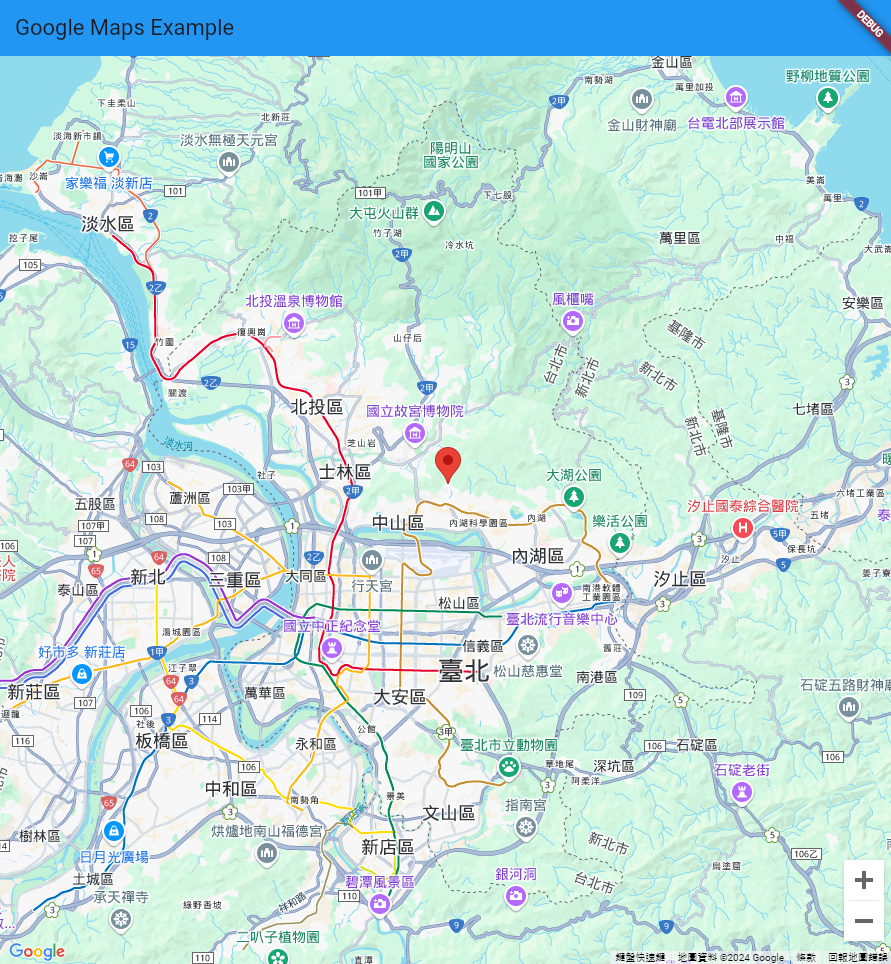

# google_maps_in_flutter

A sample Flutter project integrating the Google Maps API.

## Overview

This project demonstrates how to integrate Google Maps API into a Flutter application, providing an example for developers to use as a reference.

## Getting Started

If this is your first Flutter project, here are some helpful resources to get you started:

- [Google Maps for Flutter](https://developers.google.com/maps/flutter-package/overview)
- [google_maps_flutter](https://pub.dev/packages/google_maps_flutter)

## Features

- Google Maps integration.
- Example use cases for map-based functionalities.
- Palce api sample.
